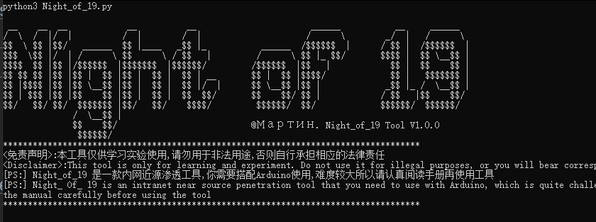

  <div align="center">
 
 <p align="center">
 
 
 
  
 
 
 
 </p>
 <table>
  <tr>
      <th>Function</th>
  </tr>
  <tr>
    <th>Switch the rebound shell session from Ethernet to Bluetooth control</th>
  </tr>
 </table>
</div>

## usage method

 * View help information

      ```#python3 Night_of_19.py -h```

  

* device

  

* (1).Arduino UNO R3
* (2).HC-05
* (3).ENC28J60


## Simulation scenario

``We will play the role of hacker perspective, as Hacker 1 and Hacker 2 are preparing to infiltrate the company offline. Due to the large number of target computer rooms, it is currently unclear which machine was hacked. What should we do?``

## Collect intranet IPs


## Configure attack devices to access the opponent's internal network


## Waiting for hacker 1 to rebound Shell, hacker 2 to launch offline attacks


